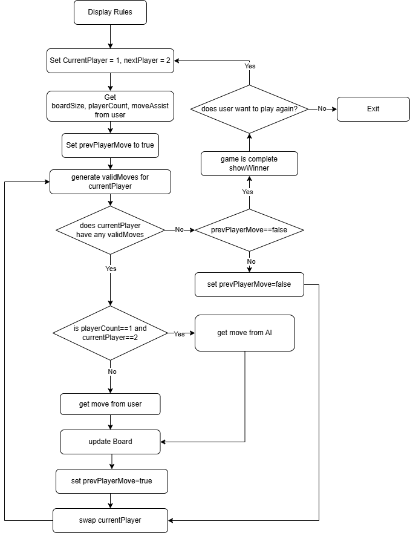
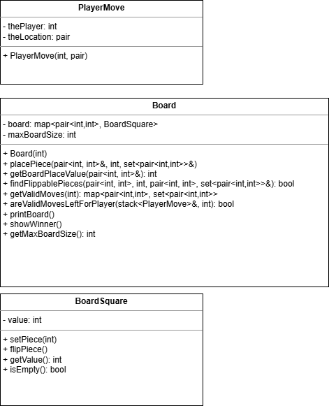

### **Over-engineer Othello/Reversi**

**Introduction**  
This is a C++ implementation of the game Othello, playable in the terminal with options for two players or one player against an “AI”. Key features include adjustable board size, move assistance, and tracking move history. 

Othello was chosen because it’s a simple yet strategic game with straightforward rules, making it suitable for terminal-based implementation. The algorithm for finding valid moves and flipping pieces is straight-forward to implement and the gameplay loop offers a few opportunities to optimize.

The code was written in about \~5 hours over a span of two days.  
As of this writing the project is self-contained in one file with  
398 lines of code, 319 comments, and 111 blank lines for a total of 828 lines.

**Approach to Development**  
The first step was creating data structures to represent the board and its squares, along with the base gameplay loop: displaying the board, accepting and validating player input (ensuring the input was on an empty space and within the bounds of the board), and updating the board based on player input.

The next step was implementing an algorithm that generated a map of all valid moves, along with a list of pieces that would be flipped if a given move was chosen.

Once the algorithm was complete, the next step was using it both to validate player moves and to check if the game was over (the game ends if neither player has valid moves remaining).

The next step was adding an “AI” player that randomly chooses to play either the move with the most flips or a random move, to fulfill the project requirements.

The final steps involved testing and debugging, adding comments to improve readability, clarifying prompts, and adding a “move assist” option.

**Version Control**  
Initial version control was just leveraging NetBeans local file history, once the first step was completed a git repo was created and the runnable points from the file history were added to git. From then on git was used. [https://github.com/rkaganda/over\_engineered\_othello](https://github.com/rkaganda/over_engineered_othello)

**Game Rules**  
Othello/Reversi is a strategic two-player game with the goal of having the most pieces of your “shape” on the board by the end of the game. Players, either 'X' or 'O', take turns placing a piece on an empty square. Each move must flip at least one of the opponent's pieces by trapping them in a straight line (horizontal, vertical, or diagonal) between the newly placed piece and another of the player’s pieces. The game ends when neither player has any valid moves left, and the winner is determined by who has the most pieces of their “shape” on the board.

**Description of the Code**  
Classes:

* BoardSquare:   
  * Represents a single square on the board, which can be empty or occupied by a player.  
    * Manages the value of the square (0 for empty, 1 for Player X, and 2 for Player O).  
    * Provides methods for setting a piece, flipping a piece, and checking if the square is empty.  
  * Board: Manages the overall game board.  
    * Initializes the board with a given size, sets up starting pieces, and stores each square's state.  
    * Methods include placing pieces, flipping pieces, checking valid moves, printing the board, and displaying the game outcome.  
    * Calculates all valid moves for a player and checks if any moves are left.

Structs:

* PlayerMove: Stores information about a player’s move.  
  * Contains the player's number and the location of the move.  
    * Used to keep track of the game's history in a stack.

User Input Validation Functions:

* getBoardSize(): Prompts the user to enter the board size, ensuring it is at least 4\. Repeats until valid input is provided.  
  * getPlayerCount(): Asks the user to enter the number of players (either 1 or 2\) and validates the input.  
  * getMoveAssist(): Prompts the user to enable or disable move assistance by entering 'Y' or 'N'.  
  * getPlayAgain(): Asks the user if they want to play another game, accepting 'Y' or 'N' as input.

Gameplay Loop Function:

* playGame(): Manages a single game session.  
  * Sets up the board, prompts for moves, checks for valid moves, and determines the game outcome.  
  * Alternates between players and tracks the game history using PlayerMove.  
  * If move assistance is enabled, it displays possible moves for the player.  
  * Ends the game when no valid moves are left for both players and announces the winner or if it’s a draw.

!

### Valid Move Algorithm:

```plaintext
getValidMoves(player) {  
    Initialize empty map validMovesMap to store valid moves.  

    For each empty square on the board {   
        Initialize totalFlippablePieces as an empty set.  

        For each direction {  
            Call findFlippablePieces(position, player, direction) {   
                Initialize an empty set toFlip.   
                
                Traverse in the given direction.  
                
                If encountering opponent's pieces {   
                    Add to toFlip.   
                }   
                
                If encountering player's piece after opponent's {   
                    Return true and keep toFlip.   
                }   
                
                If encountering an empty square or reaching board boundary {   
                    Clear toFlip and return false.   
                }   
            }   
            
            If findFlippablePieces returns true {   
                Add toFlip to totalFlippablePieces.   
            }   
        }   
        
        If totalFlippablePieces is not empty {   
            Add position and totalFlippablePieces to validMovesMap.   
        }   
    }   
    
    Return validMovesMap with all valid moves and flippable pieces.   
}
```

Class UML:  


### **1\. Container Classes**

1. **Sequences**  
   * `std::list`  
     * **Used in**: `directions` constant list (global scope) to hold pairs representing directions on the board.  
     * **Usage**: Stores directional vectors used for checking flippable pieces.  
2. **Associative Containers**  
   * `std::map`  
     * **Used in**: `board` (member of `Board` class) to represent board positions mapped to `BoardSquare` objects.  
     * **Usage**: Stores and manages board state, where each key is a coordinate and each value is a square.  
   * `std::set`  
     * **Used in**: `placePiece`, `findFlippablePieces`, and `getValidMoves` methods of `Board`.  
     * **Usage**: Temporarily stores sets of flippable positions in different directions.  
3. **Container Adaptors**  
   * `std::stack`  
     * **Used in**: `playGame` to hold `gameHistory`, recording moves.  
     * **Usage**: Tracks move history for potential backtracking or game history management.  
   * `std::priority_queue`  
     * **Used in**: `getAIMove`.  
     * **Usage**: Stores moves by descending order of flip count to assist in AI decision-making.

### **2\. Iterators**

1. **Concepts**  
   * **Trivial Iterator**: Used in `printBoard` in the `for` loop iterating over board state.  
   * **Input Iterator**: `std::find_if` in `getValidMoves` for finding empty squares.  
   * **Output Iterator**: In `placePiece` with `std::for_each` to flip pieces at specified positions.  
   * **Bidirectional Iterator**: Used with `std::map` iterators in methods like `showWinner` for counting pieces.  
   * **Random Access Iterator**: Used indirectly in `getAIMove` to get a random move from a list of valid moves.

### **3\. Algorithms**

1. **Non-mutating algorithms**  
   * `for_each`  
     * **Used in**: `placePiece` method in `Board`.  
     * **Usage**: Iterates through positions in `toFlip` to apply flips.  
   * `find`  
     * **Used in**: `isPlayerMoveValid` method to validate if a move exists in `validMoves`.  
   * `count`  
     * **Used in**: `showWinner` method in `Board` class.  
     * **Usage**: Counts pieces for each player to determine the winner.  
2. **Mutating algorithms**  
   * `swap`  
     * **Used in**: `playGame` for swapping `currentPlayer` and `nextPlayer`.  
   * `random_shuffle`  
     * **Used in**: `getAIMove` in selecting a random move for the AI.  
3. **Organization**  
   * `sort`  
     * **Used in**: `getAIMove` to sort moves by number of flips in descending order.

